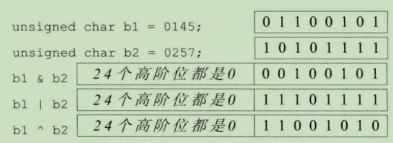
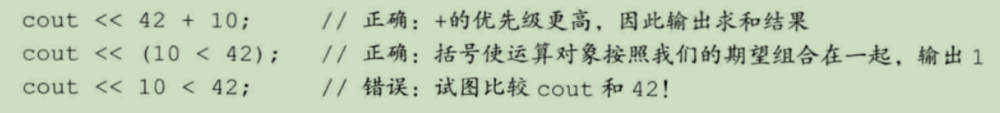
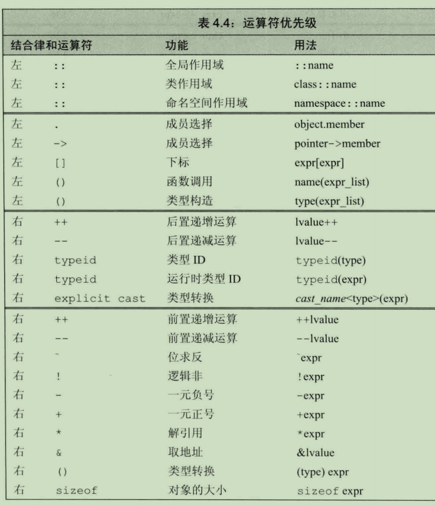
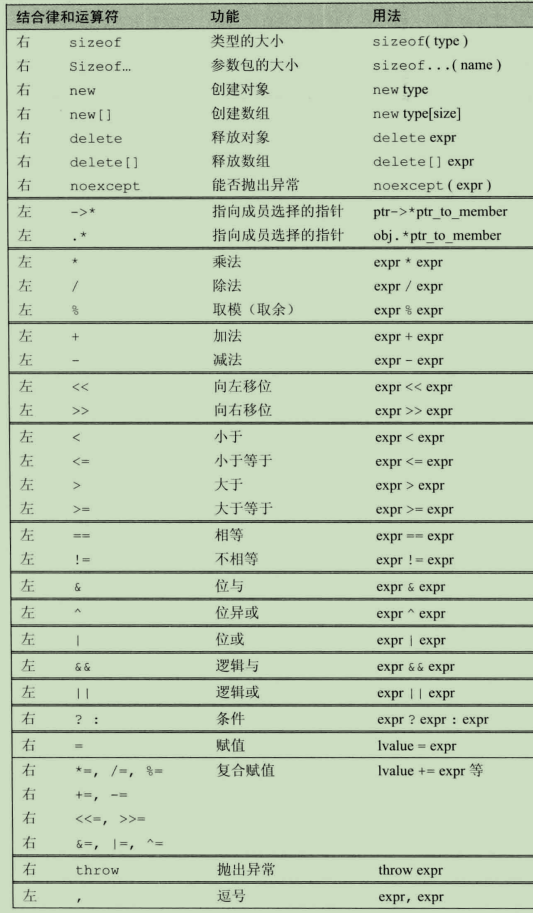

# 表达式

表达式由一个或多个运算对下个组成，**对表达式求值将得到一个结果**。字面值和变量是最简单的表达式，其结果是字面值和变量的值。把运算符和一个或多个运算对象组合起来就能。
## 基础
- 运算符主要分为`一元运算符`和`二元运算符`。此外还有一个三元运算符。
- 运算符有优先级
- 运算对象转换
- 运算符可以重载
- 使用关键字decltype的时候,左值和右值也有所不同，如果表达式的求值结果是左值，decltype作用于该表达式得到一个引用类型。

###  优先级和结合律
**复合表达式**指包含两个或多个运算符的表达式。优先级和结合律决定了运算对象组合的方式。
- 如果运算符的优先级相同，将按照从左向右的顺序组合运算对象。
- 括号无视优先级和结合律
- 求值顺序

> 1、拿不准的时候最好用括号强制让表达式的组合关系符合逻辑要求
> 2、如果改变了某个运算对象的值，在表达式的其他地方不要再使用这个运算对象

## 算数运算符

| 运算符 | 功能 | 用法 | 
| --- | --- | --- | --- | 
| + | 一元正号 | + expr | 
| - | 一元负号 | - expr | 
| | | |
| * | 乘法 | expr * expr |
| / | 除法 | expr / expr |
| % | 求余 | expr % expr |
| | | |
| + | 加法 | expr + expr | 
| - | 减法 | expr - expr | 

- 算术运算符的运算对象和求值结果都是右值
- 在求值之前，小整数类型的运算对象被提升成较大的整数类型。
- C++早期版本允许结果为负值的商向上或向下取整，C++11一律向0取整。

## 逻辑和关系

关系运算符作用于算数类型或指针类型，逻辑运算符作用于任意能转换成布尔值的类型。**运算对象和求值结果都是右值**

| 结合律 | 运算符 | 功能 | 用法 |
| --- | --- | --- | --- |
| 右 | ！ | 逻辑非 | !expr |
| | | |
| 左 | < | 小于 | expr < expr | 
| 左 | <= | 小于等于 | expr <= expr |
| 左 | > | 大于 | expr > expr |
| 左 | >= | 大于等于 | expr >= expr |
| | | |
| 左 | == | 相等 | expr == expr |
| 左 | ！= | 不相等 | expr != expr |
| | | |
| 左 | && | 逻辑与 | expr && expr |
| | | |
| 左 | \|\| | 逻辑或 | expr \|\| expr |

逻辑与和或都是先求左侧运算对象的值再求右侧的值，当且仅当左侧运算对象无法确定表达式的结果才会计算右侧的值。称为**短路求值**

- 关系运算符
关系运算符比较运算对象的大小关系并返回布尔值，左结合律；当多个运算符连写在一起会产生特殊问题
```c++
if (i < j < k) 
// 根据左结合律 (i < j) < k ，括号内得到的是bool值，然后和k比较

if (i < j && j < k) // 正确写法
```

```c++
int a = 10;
int c = 1;
if (a == true) {
	cout <<"true" << a << endl;
}
if (c == true) {
	cout << c << endl;
}
if (a) {
	cout << a << endl;
}
```
```
out：
    1
    10
```
结果第一个没有输出，因为当使用 a == true 进行运算时，会将true转成1，类型转换的原因
> 进行比较运算时除非比较的对象时布尔类型，否则不要使用布尔字面值true和false作为运算对象。

## 赋值运算符

赋值运算符的左侧运算对象必须时一个可修改的左值，赋值运算的结果就是它的左侧运算对象，并且时一个左值。相应的，结果的类型就是左侧运算对象的类型。如果赋值运算符左右两个运算对象的类型不同，则右侧运算对象的类型将转成左侧运算对象的类型。

赋值运算满足右结合律
```c++
cout << (a = 5) << endl;
int ival, jval;
ival = jval = 10; // ival = (jval = 10)
cout << ival << jval << endl;
```
```
out:
    5
    10  10
```

赋值运算符的优先级低于关系运算符的优先级，所以在条件语句中，赋值部分通常应该加上括号。
- 复合运算符
`+= -=`等，区别在于使用复合只求值一次，使用普通的运算符求值两次：一次时做右边子表达式的一部分求值，另一次作为赋值运算的左侧运算对象求值。

## 递增和递减运算符

递增 ++ 递减 --
分为**前置**和**后置**两个版本。
```C++
int i = 0, j;
j = ++i; // j=1, i=1 前置版本是先加后用，对象本身作为左值返回
j = i++; // j=1, i=2 后置版本是先用后加，后置版本将对象原始值的副本作为右值返回
```
> 除非比较，不要使用后置版本；因为前置修改的对象本身，而后置则需要将原始值存储下来，以便于返回这个未修改的内容。浪费~~

```c++
vector<int> v = { 1, 2, 3, -4, 5 };
auto pbeg = v.begin();
while (pbeg != v.end() && *pbeg >= 0)
{
	cout << *pbeg++ << endl; // *(pbeg++)
}
```
```
out:
    1 
    2
    3
```
> 上面的情况使用后置则即可以递增，又能返回当前值

## 成员访问运算符

点运算符和箭头运算符都可用于访问成员，其中点运算符取类对象的一个成员;箭头运算符与点运算符有关

```c++
ptr->mem 
(*ptr).mem 
//因为解运算符的优先级低于点运算符，所以解运算的子表达式两端必须加括号
```

> 箭头运算作用于指针类型，结果是一个左值。点运算符分为两种情况，如果成员所属是左值，结果就是左值，反之，所属对象是右值，结果就是右值。

## 条件运算符

```c++
cond ? expr1 : expr2
```
条件运算符的优先级非常低，需要注意加括号
```c++
// 1
cout << ((grad < 60) ? "fail" : "pass" );

// 2
cout << (grad < 60) ? "fail" : "pass" ;
// 等价于
(cout << (grad < 60)) ? "fail" : "pass" ;

// 3
cout << grad < 60 ? "fail" : "pass" ;
((cout << grad) < 60) ? "fail" : "pass" ;
```

## 位运算符

位运算符作用于整数类型的运算对象，并把运算对象看成是二进制位的集合。

| 运算符 | 功能 | 用法 |
| --- | --- | --- |
| \` | 位求反 | `expr | 
| | | |
| << | 左移 | expr1 << expr2 |
| >> | 右移 | expr1 >> expr2 |
| | | |
| & | 位与 | expr1 & expr2 | 
| | | |
| ^ | 位异或 | expr1 ^ expr2 |
| | | |
| \| | 位或 | expr1 \| expr2 |

> 关于符号位如何处理没有明确的规定，所以仅将位运算符用于处理无符号类型  
> 如果运算对象带符号，在左侧插入符号位的副本或值位0的二进制位，如何选择视情况而定。
> char 类型提升为int类型，提升时保持对象原来的位保持不变，往高位添加0



- 移位运算符左结合
- 移位运算符的优先级低于算术运算，高于关系，赋值，条件
- `cout <<`是位移的重载 



## sizeof运算符

返回一条表达式或一个类型名字所占的字节数。sizeof 运算符满足右结合律，得到一个`size_t`的常量表达式。
```c++
sizeof(type)
sizeof expr
```
```c++
Sales_data data, *p;
sizeof (Sales_data); // 对象所占空间大小，类型
sizeof data.revebye; // 表达式
sizeof p; // 指针所占空间
```
- 得到整个数组所占空间的大小
- 对string对象或vector对象执行sizeof只返回该类型固定部分的大小，不会计算对象中元素占用多少空间

```c++
cout << sizeof(v) << endl;
string sa = "abc";
string sb = "abcabc";
cout << sizeof(sa) << endl;
cout << sizeof(sb) << endl;
```
```
out:
    32
    40
    40
```

## 逗号运算符

逗号运算符含有两个运算对象，按照从左到右的顺序依次求值  
首先对左侧表达式求值，然后将求值结果丢弃，保留右侧，满足左结合律。

## 类型转换

C++会进行隐式转换；算数类型之间的隐式转换被设计得尽可能避免损失精度。
- 比int类型小的整型值首先提升位较大的整数类型。
- 在条件中，非布尔值转换成布尔类型
- 初始化过程中，初始值转换成变量的类型；在赋值语句中，右侧运算对象转换成左侧运算对象的类型。
- 如果算术运算或关系运算的运算对象有多种类型，需要转换成同一种类型。
- 函数调用也会发生类型转换

### 算术转换
运算符的运算对象将转换成最宽的类型。
- 整数提升：将小整数类型转换为较大的整数类型。
- 如果一个运算符对象是无符号，另一个是带符号的。无符号类型不小于带符号的，带符号的运算对象转换成无符号的。如果int型的值恰好为负值，则会有副作用。
- 如果带符号的大于无符号的，如果无符号类型的所有值都能存在该带符号类型中，则无符号类型的运算对象转换成带符号类型。否则带符号类型的运算对象转换成无符号类型。

### 其他隐式转换
- 数组转换成指针
- 指针的转换：void*
- 布尔类型：如果指针或者算术类型的值为0，转换结果为false，否则true
- 转换成常量：允许将指向非常量类型的指针转换成指向相应的常量类型的指针，对于引用也是这样。
```c++
int i;
const int &j = i; // 非常量转换成const int 的引用
const int *p = &i; // 非常量的地址转换成const 的地址。
```

### 显式转换

> 显式转换会有潜在的风险

```C++
cast-name<type>(expression)
```
cast-name: **static_cast**, **dynamic_cast**, **const_cast**, **reinterpret_cast**

- static_cast  
    任何具有明确定义的类型转换，只要不包含底层const，都可以使用static_cast
```C++
double slope = static_cast<double>(j) / i
```
- const_cast  
  const_cast只能改变运算对象的底层const,去掉const性质
```c++
const char *pc;
char *p = const_cast<char*>(pc);
```
- reinterpret_cast  
    reinterpret_cast通常为运算对象的位模式提供较低层次上的重新解释。非常有危险
```c++
int *ip;
char *pc = reinterpret_cast<char*>(ip);
// 其实pc指向的式int类型的指针
```
- 旧式类型转换  
使用旧式的可以实现上述的显示转换
```c++
type (expr);
(type) expr;
```
## 运算符优先级表


