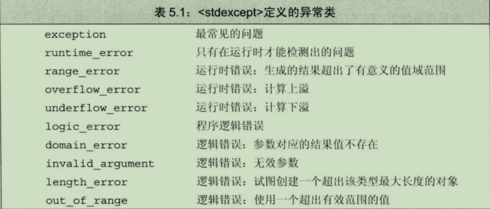

# 语句

## 简单语句
大多语句以分号结束。  
**空语句**只包含一个单独的分号。类似于python中的`pass`。
**复合语句**用花括号括起来的语句和声明的序列，也称为**块**。 一个块就是一个作用域，在块中引入的名字只能在块内部以及嵌套在块中的子块里访问。

## 语句的作用域

可以在if，swith，while和for语句的控制结构内定义变量，定义在控制结构中的变量只在相应语句的内部可见，一旦语句结束，变量也就超出其作用范围了。

## 条件语句

### if语句

判断一个指定条件是否为真，根据判断结果决定是否执行另外一条语句。
```C++
if (condition)
    statement // 通常式块语句 {}
else
    statement
```
当if数量大于else时，会产生悬垂else，else与离它最近的尚未匹配的if匹配。使用花括号可以控制else的匹配

### switch语句

提供了一条遍历的途径是我们能够在若干固定选项中做出选择。
```c++
string s = "hello, world";
unsigned aCnt = 0, eCnt = 0, iCnt = 0, oCnt = 0, uCnt = 0;
auto iter = s.begin();

while (iter != s.end())
{
	switch (*iter) // 对表达式求值，这里是取迭代器指向的值
	{
	case 'a': // case标签必须是整型常量表达式，任意两个case的值不能相同
		++aCnt; // 表达式的值与逐个case进行匹配，匹配成功才执行该case下的内容。
		break; // 遇到break则跳出switch
	case 'e':
		++eCnt;
		break;
	case 'i':
		++iCnt;
		break;
	case 'o':
		++oCnt;
		break;
	case 'u':
		++uCnt;
		break;
	default: // 没有匹配上的则执行这句
		break;
	}
	++iter;
}
cout << aCnt << " " << eCnt << " " << iCnt << " " << oCnt << " " << uCnt << endl;
```
> 某个case匹配成功则将顺序执行剩下的所有case分支，除非显式的中断这一过程，这也是上面每个case接一个break的原因

```c++
// 统计所有元音字母
iter = s.begin();
while (iter != s.end())
{
	switch (*iter)
	{
	case 'a':
	case 'e':
	case 'i':
	case 'o':
	case 'u':
		++vowelCnt;
		break;
	default:
		break;
	}
	++iter;
}
```

## 迭代语句

### while语句

只要条件为真，while语句就重复执行操作直到满足某个条件才停下来。
```C++
while(condition)
    statement
```

### 传统for语句

```c++
for (init-statement; condition; expression)
    statement
```

### 范围for语句

```c++
for (declaration : expression)
    statement
```
expression 必须是一个序列，这些类型的共同特点是拥有能返回迭代器的begin和end成员。  
declaration 定义一个变量，序列中的每个元素都能转换成该变量的类型。确保类型相容最简单的方法是使用auqto类型说明符。
如果需要修改序列的值，要声明为引用类型。

### do while

```C++
do 
    statement
while (condition)
```

## 跳转语句

跳转语句中断当前的执行过程。

### break语句

负责终止离它**最近的**while, do while, for, switch语句。并从这些语句之后的第一条语句开始继续执行。

### continue语句

终止最近的循环中的当前迭代并立即开始下一次迭代。只能出现在 for, while, do while内部。

### goto语句

从goto语句无条件跳转到**同一函数内**的另一条语句。尽量不要使用

```
goto label; // label 是一条语句的标识符，带标签语句是一种特殊的语句。在它之前有一个标识符以及一个冒号
end: return; // 表示符独立于变量或其他标识符的名字，因此，标签标识符可以和程序中的其他实体标识符同一个名字不互相干扰。
```

## try语句块和异常处理

**throw表达式**，异常检测部分使用throw表达式来表示它遇到了无法处理的问题，引发异常  
**try语句块**， 异常处理部分使用try处理异常，try语句块以关键字try开始，并以一个或多个catch子句结束。  
**异常类**，用于在throw表达式和相关catch子句之间传递异常的具体信息。

### throw 表达式
throw表达式包含关键字throw 和 紧随其后的一个表达式，其中表达式的类型就是抛出的异常类型。

### try语句块
```c++
try {
    ...
} catch(exception-declaration){ // 异常声明
   ...
}catch(exception-declaration){
   ...
}
```

```C++
float a, b;
while (cin >> a >> b)
{
	try {
		if (b == 0)
			throw runtime_error("除数不能为0");
		cout << a / b << endl;
	}
	catch (runtime_error err) {
		cout << err.what();
		cout << "\n Try Again? y or n" << endl;
		char c;
		cin >> c;
		if (!cin || c == 'n')
			break;
	}
}
```
```
out:
    3 2
    1.5
    4 0
    除数不能为0
    Try Again? y or n
    y
    4 2
    2
```

### 标准异常
标准库定义了一组类，用于报告标准库函数遇到的问题。
- exception 头文件定义了最通用的异常类exception,它只报告异常的发生，不提供额外的信息。
- stdexcept 头文件定义了几种常用的异常类
- new头文件定义了bad_alloc异常类型
- type_info 头文件定义了bad_cast异常类型



只能用默认初始化的方式初始化exception, bad_alloc bad_cast,不允许为这些对象提供初始值。
而其他的类型则需要使用字符串进行初始化。  
异常类型之定义一个名为what的成员函数，该函数没有任何参数，返回值是一个C风格字符串的const char*,提供关于异常的一些文本信息。
如果异常类型有一个字符串初始值，则what则返回该字符串。对于其他无初始化的异常类型来说，返回内容由编译器决定。