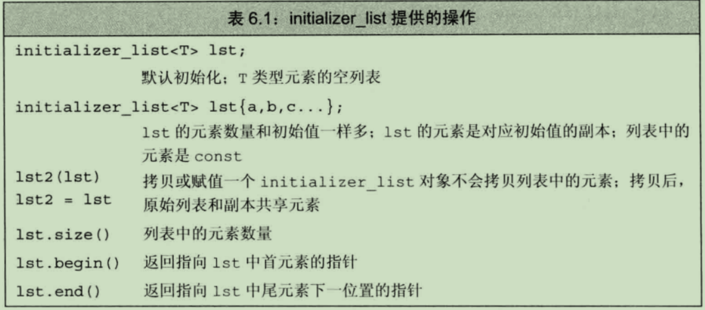
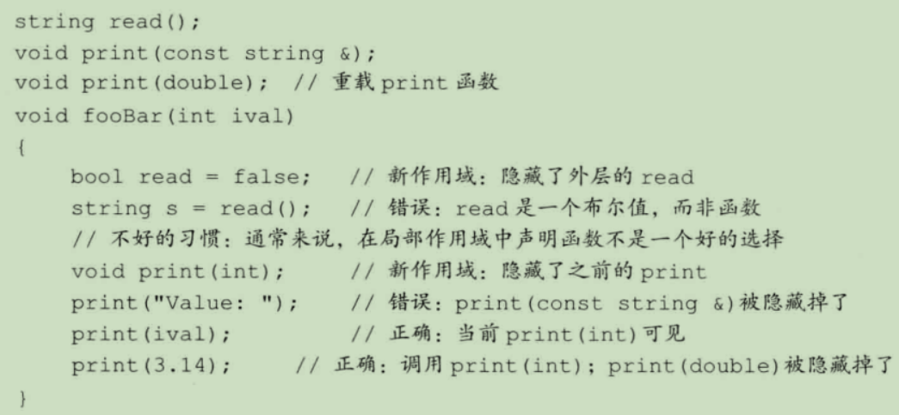
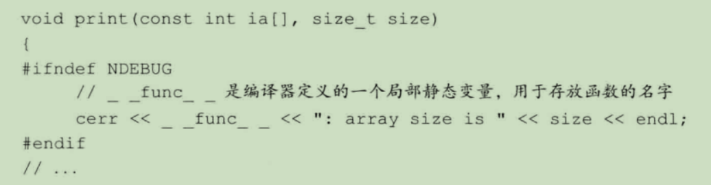

# 函数

函数是一个命名了的代码块，可以重载

## 函数基础

典型函数包括：返回类型， 函数名字， 形参， 函数体

函数调用过程：
- 用实参初始化对应的形参
- 将控制权转移给被调用函数，此时主调函数的执行被暂时中断，被调函数开始执行。

当遇到一条return 语句时函数结束执行过程。
- 返回return语句中的值
- 将控制权从被调函数转移回主调函数

**形参和实参**
- 实参是形参的初始值。按顺序存在对应关系；
- 实参大的类型必须于对应的形参类型匹配

**形参列表**

函数的形参列表可以为空，但不能省略
```c++
void f1(){}
void f2(void){} // 显式定义空形参列表
void f3(int v1, int v2); // 每个形参必须含有一个声明符的声明，不能省略类型，用逗号隔开
```

**返回类型**

大多数类型都能用作函数的返回类型。特殊的返回类型是void，表示不返回任何值。  
返回值不能是数组或函数，但是可以是指向数组或函数的指针

### 局部对象

名字由作用域，在程序的一部分内，名字在其中可见。  
对象有生命周期，在程序执行过程中该对象存在的一段时间。

函数体是一个新的作用域，在其内定义的变量统称为局部变量。尽在函数的作用域内可见。同时隐藏在外层作用域的同名变量。

所有函数体外定义的对象存在于程序的整个执行过程中。直到程序结束才销毁，局部变量的生命周期依赖于定义的方式。

- 局部静态对象

将局部变量声明成**static**类型可以使局部变量的生命周期贯穿函数调用及之后的时间。

局部静态变量在程序的执行路径第一次经过对象定义语句时初始化，并且直到程序终止才被销毁，函数结束对其没有影响。

```c++
size_t count_calls() {
	static size_t ctr = 0;
	return ++ctr;
}

int main() {
	for (size_t i = 0; i != 10; ++i) {
		cout << count_calls() << endl;
	}

	return 0;
}
```

### 函数声明

和变量一样，**函数只能定义一次，但可以声明多次**，声明没有函数体，可以不提供形参的名字。  
函数的声明应该在头文件中进行。

### 分离式编译

允许将程序分割到几个文件中去，每个文件独立编译。如果修改了其中一个源文件，编译时只需要改动修改的文件。

## 参数传递

形参初始化的机理和变量初始化一样。  
**引用调用**：当形参是引用类型是，它就是对应实参的别名，可以通过它修改实参的值。  
**传值调用**而当实参的值背拷贝给形参时，形参和实参时两个互相独立的对象。

### 传值参数

初始化一个非引用类型的变量时，初始值被拷贝给变量，对变量的改动不会影响初始值。  
如果是指针，则两个指针的值不同，但是指向的内容相同。
建议使用引用类型的形参替代指针。

### 传引用参数

- 使用引用形参，允许函数改变一个或多个实参的值。  
- 使用引用可以避免拷贝。
- 使用引用形参可以返回额外信息。解决函数只能返回一个值的问题。

### const 形参和实参

- 当形参是const时，不能通过引用修改值，所以把函数不会改变的形参定义成常量引用

### 数组形参

数组的性质：不允许拷贝，将其转成指针。

```c++
void print(const int*);
void print(const int[]);
void print(const int[10]);
```

传递多维数组
```c++
void print(int (*matrix)[10], int rowSize); 
```

### main()参数

```c++
int main(int argc, char *argv[]);
```
- argc 标识argv数组中字符串的数量
- argv 时字符串数组，第一个元素指向程序的名字或者空字符串， 接下来的元素一次传递命令行提供的实参，最后一个指针之后的元素值保证为0

### 含有可变形参的函数

当不确定实参的数量时，可以用以下方法：
- 如果实参类型相同，用initializer_list标准库类型
- 实参类型不同，编写一个特殊的函数，可变参数模板
- 特殊的形参类型，省略符

**initializer_list**


initializer_list的元素永远时常量值，无法改变对象中元素的值。

```c++
void print(initializer_list<int> a) {
	for (auto s = a.begin(); s != a.end(); ++s) {
		cout << *s << endl;
	}
}

int main() {

	int ia = 5;
	print({ ia, 6 });

	return 0;
```

**省略符形参**
省略符形参应该仅仅用于c和C++通用的类型，特别注意的是，大多数类类型的对象在传递给省略形参时都无法正确拷贝；  
省略相残只能出现在列表的最后一个位置
```c++
void foo(parm_list, ...);
```

## 返回类型和return语句

**return**语句终止当前正在执行的函数并将控制权返回到调用该函数的地方。

### 无返回值函数

没有返回值的return只能在返回类型为void的函数中。  
如果返回类型为void，使用return expression, 则 expression必须是另一个返回值为void的函数。

### 有返回值函数

如果返回类型不是void，函数内的return必须返回一个值，而且类型必须和函数的返回类型相同。或者隐式地转换成函数的返回类型。

在含有return语句的循环后面应该也有一条return语句，如果没有的话该程序就是错误的。  

返回值用于初始化被调用点的一个临时量，该临时量就是函数调用的结果。如果是引用则是该引用指向对象的另一个别名。

**不要返回局部对象的引用或指针**，函数完成后，它所占用的存储空间也随之被释放掉。因此，函数终止意味着局部变量的引用将指向不在有效的区域。

主函数的返回值，如果没有指定默认为 return 0, 表示程序的执行状态为成功，其他值为失败。在cstdlib中定义了两个预处理变量，我们可以使用这两个变量分别表示成功和失败。
`EXIT_FAILURE``EXIT_SUCCESS`。

### 返回数组指针
函数不能返回数组，但是可以返回数组的指针会引用。
```c++
typedef int arrT[10]; // arrT是数组的别名
using arrT = int[10]; // arrT的等价声明

arrT* func(int i); // 返回一个值指含有10个整数的数组的指针
```

- 尾置返回类型
c++11使用尾置返回类型，任何函数的定义都能使用尾置返回。
```C++
auto fun(int i) -> int(*) [10]; // 表示函数返回的是一个指针，该指针指向了含有10个整数的数组。
```
- 使用decltype
如果知道函数返回的指针指向哪个数组，可以使用decltype声明返回类型。

```c++
int odd[] = {1, 2, 3, 4, 5};
int odd[] = {1, 2, 3, 4, 5};
decltype(odd) *arrptr(int i){
    return (i % 2) ? &odd : & even;
}
```
decltype不负责将数组类型转换成对应的指针，所以结果是个数组，需要附加一个*声明

## 函数重载

同一个作用域内的几个函数名字相同当形参不同，称为重载函数。
> main函数不能重载

### 定义重载函数

```c++
int add(int a, int b) {
	return a + b;
}

float add(float a, float b) {
	return a + b;
}

string add(string& a, string& b) {
	return a + b;
}

int i_a = 1, i_b = 3;
float f_a = 3.14, f_b = 5.5;
string s_a = "hello", s_b = "world";

cout << add(i_a, i_b) << endl;
cout << add(f_a, f_b) << endl;
cout << add(s_a, s_b) << endl;
```
```
4
8.64
helloworld
```
对于重载的函数而言，三个函数各不相同，但是都有同一个名字，编辑器会根据实参的类型决定应该调用哪一个函数。它们应该在形参数量或者形参类型上有所不同。
不允许两个函数除了返回类型外其他所有要素都相同。

### 重载和const形参

顶层const的形参无法和另一个没有顶层const的形参区分开来。
```c++
//两者等价
int get(int);
int get(const int);
```

如果形参是某种类型的指针或引用，通过区分其指向的是常量对象还是非常量对象可以实现函数重载
```c++
int get(int);
int get(const int&);
```

### 调用重载的函数
当两个重载函数参数相同且参数类型可以互相转换时：
- 与实参最佳匹配的函数
- 找不到任何一个函数与调用的实参匹配，则发出无匹配错误
- 有多个可以匹配，二义性错误

### 重载与作用域
> C++语言中，名字查找发生在类型检查之前



## 特殊用途语言特性
### 默认实参
```C++
int add(int a = 10, int b = 10){}；
```
为每个形参提供默认实参，默认实参作为形参的初始值出现在形参列表中。**一旦某个形参被赋予了默认值**，它后面的所有形参都必须由默认值。

```c++
add(20); // add(20, 10);
add(); // add(10, 10);
```
想使用默认实参，只要在调用函数的时候省略实参就可以了。  
设计默认实参函数时，要合理设置形参的顺序，尽量让不怎么使用默认值的形参出现在前面，经常使用默认值的出现在后面。

- 应该在函数声明中指定默认实参，并将该声明放在合适的头文件中。

- 默认实参初始值
```c++
sz wd = 80;
char def = ' ';
sz ht();

string screen(sz = ht(), sz = wd, char = def);
```
局部变量不能作为默认实参，除此之外，只要表达式的类型能转换成形参所需的类型，该表达式就能作为默认实参。

### 内联函数和constexpr函数

内联函数可避免函数调用的开销。在函数名称前添加关键字**inline**，就可以声明为内联函数，内联机制用于优化规模较小，流程直接，调用频繁的函数。

constexpr函数是指能用于常量表达式的函数。定义constexpr函数：函数的返回类型和所有形参的类型都是字面值类型，并且函数体中必须有且只有一条return语句。

### 调试帮助

assert预处理宏：
```c++
assert(expr);
```
对expr求值，如果表达式为假，assert输出信息并终止程序的执行。 定义在cassert头文件中。

NDEBUG：预处理变量。如果定义了NDEBUG,assert什么都不做，默认状态下没有定义。   
如果使用#define定义了NDEBUG，从而关闭调试状态。



- `__func__`, 输出当前调用函数的名字
- `__FILE__`,存放文件名的字符串字面值
- `__LINE__`, 存放当前行号的整型字面值
- `__TIME__`,存放文件编译时间的字符串字面值
- `__DATA__`,编译日期

## 函数匹配

- **候选函数** 与被调用的函数名称相同，声明在调用点可见
- **可行函数** 形参数量与提供的实参数量相等，每个实参的类型与对应的形参类型相同或者能互相转换
- 寻找最佳匹配
  - 精准匹配
    - 实参类型和形参类型相同
    - 实参从数组类型或者函数类型转换为对应的指针函数
    - 向实参添加顶层const或者从实参中删除顶层const
  - 通过const转换实现的匹配
  - 通过类型提升实现的匹配
  - 通过算术类型转换或指针转换
  - 通过类类型转换实现

## 函数指针

函数指针指向的是函数而非对象。

```c++
bool compare(const string&, const string &);

bool (*pf)(const string&, const string &); // 函数指针
```

### 使用

当我们把函数名作为一个值使用时，该函数自动转换成指针。

```c++
pf = compare;

bool b1 = pf("hello", "goodhad");
```

### 函数指针形参

不能定义函数类型的形参，但是形参可以是指向函数的指针

```C++
void useBigger(const string &s1, const string &s2,
    bool pf(const string &, const string &); // 自动将第三个参数转换为指向函数的指针

void useBigger(const string &s1, const string &s2,
    bool (*pf)(const string &, const string &);

// Func Func2是函数类型，
typedef bool Func(const string&, const string&);
typedef dectype(lengthCompare) Func2;

typedef bool (*FuncP)(const string&, const string&);
typedef dectype(lengthCompare) (*FuncP2);

void useBigger(const string &s1, const string &s2, Func);
void useBigger(const string &s1, const string &s2, FuncP);

useBigger(s1, s2, lengthCompare);
```

### 返回指向函数的指针
需要把返回类型写成指针形式，需要声明一个返回函数指针的函数，最简单的方法是使用类型别名：
```c++
using F = int (int *, int);
using PF = int(*) (int *, int);

int ss(int *, int);

F *f1(int); // 显示指定返回类型是指向函数的指针

auto f1(int) -> int(*)(int *, int); //后置返回类型
dectype(a) *f1(int); //使用decltype获取函数类型
```
